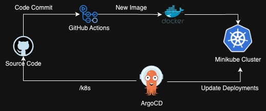
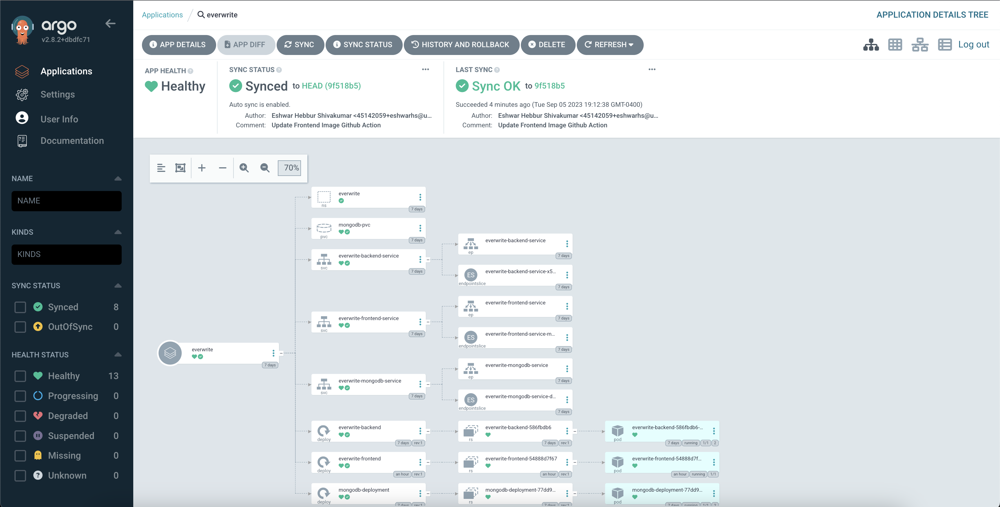
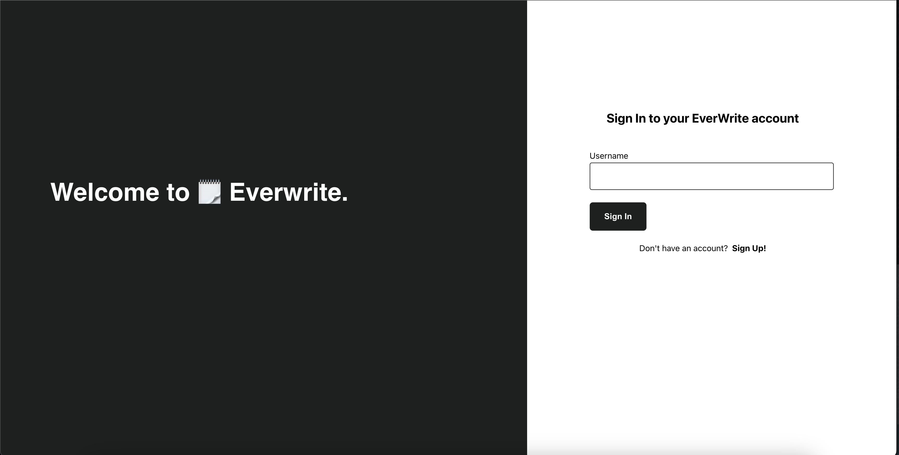
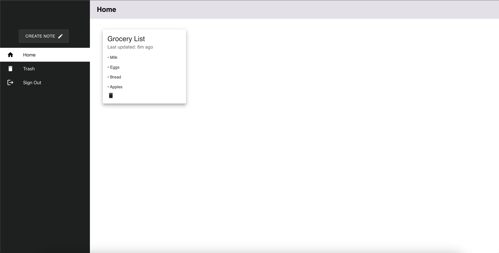
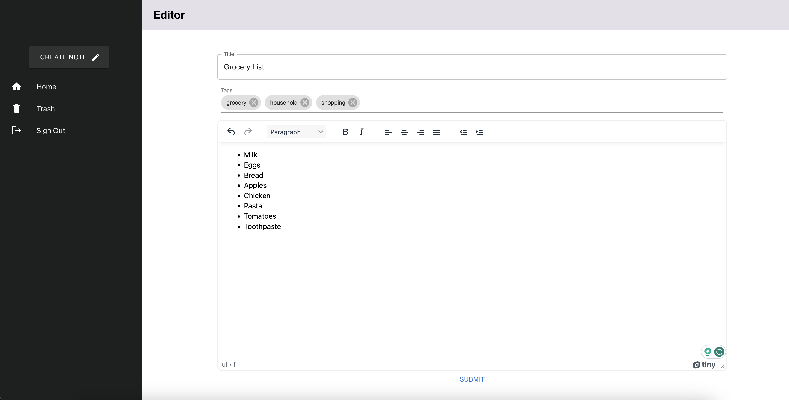
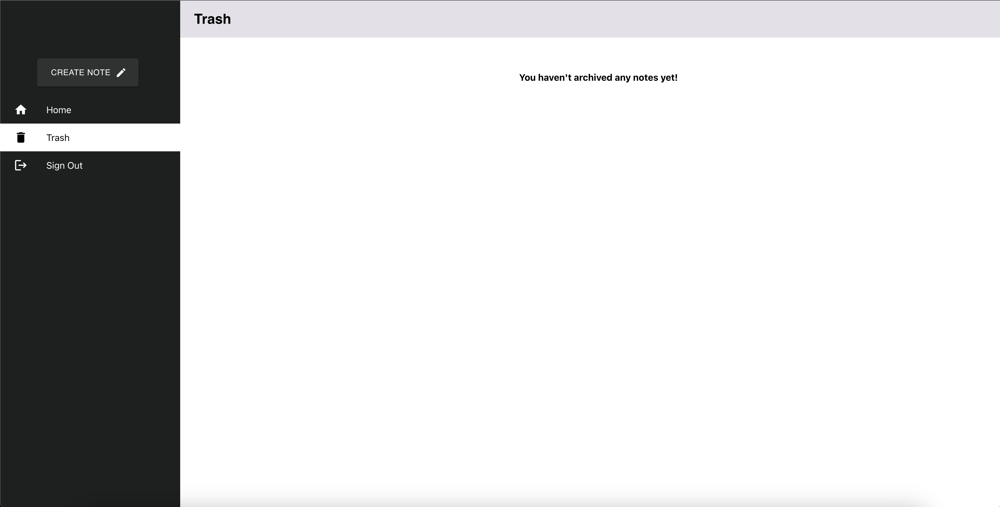

# EverWrite

🗒 EverWrite is a powerful and intuitive note-taking app designed to boost your productivity. Capture and organize your thoughts, ideas, and important information effortlessly.

<hr>

### Technical Specifications
- Frontend Application developed using React.js
- Backend Application developed using Python and Flask
- CI/CD using GitHub Actions and ArgoCD
- Monitoring and Observability using Prometheus and Grafana

<hr>

### Architecture

#### CI/CD Flow
<br>


<hr>

### Setup 
<b>Pre-requisites: Docker, Minikube, kubectl </b>
1. Pull the code to your local directory
2. Deploy the K8 configurations on Minikube cluster
```
cd k8s
kubectl apply -f namespace.yml
kubectl apply -f backend-deployment.yml
kubectl apply -f frontend-deployment.yml
kubectl apply -f mongodb-deployment.yml
```
3. To access the frontend web app  -
```
minikube service everwrite-frontend-service -n everwrite
```

&nbsp; &nbsp; &nbsp; &nbsp; &nbsp; To access the backend API server  -
```
minikube service everwrite-frontend-service -n everwrite
```

4. Set Up ArgoCD locally and create an application for Everwrite -


<hr>

### Screenshots

<br><br><br>
<br><br><br>
<br><br><br>
<br>
